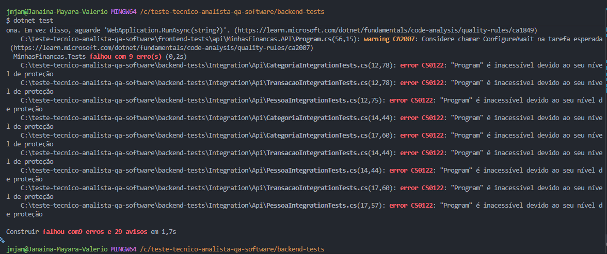

## 🐞 Falha ao executar Testes de Integração

## 📝 Descrição:
Ao executar os testes de integração, ocorre erro de compilação impedindo a execução.

## ☑️ Evidência:



## 🗒️ Erro apresentado:

```csharp
CS0122: "Program" é inacessível devido ao seu nível de proteção
```


## ⚠️ Causa provável:
A classe Program da API não está exposta publicamente, impedindo o uso de WebApplicationFactory<Program> nos testes.

## ☢️ Impacto:
- Não é possível executar testes de integração baseados em host in-memory sem modificar a API.
- A camada de API não pode ser validada isoladamente.
- A cobertura de regras de negócio e endpoints precisou ser garantida via testes End-to-End (Playwright).

## 💡 Decisão Técnica
- Os testes de integração foram mantidos no repositório como evidência da tentativa.
- A validação dos endpoints foi transferida para os testes E2E, garantindo cobertura dos fluxos críticos.
- Alterações na API foram descartadas, pois o escopo do desafio proíbe modificações no código da aplicação.